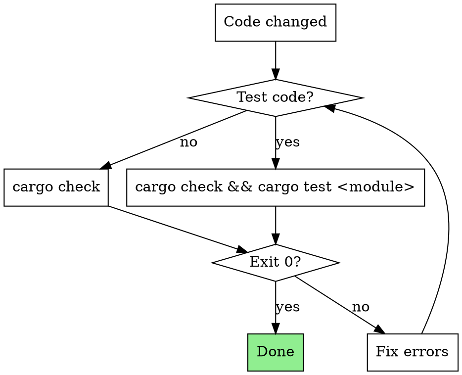

# Rust Verification (Lightweight Mode)

## Overview

**Core principle:** `cargo check` for fast iteration; defer clippy and full test to branch completion.

## Quick Reference

| Change Type | Command |
|-------------|---------|
| Regular code | `cargo check` |
| Test code modified | `cargo check && cargo test <module>::tests` |
| Cargo.toml / build.rs | `cargo check` |

**Test code = files in `tests/`, `*_test.rs`, or containing `#[test]`**

## The Rule

```
CARGO CHECK MUST PASS BEFORE CLAIMING TASK COMPLETE
```

- Exit code 0 = pass
- Warnings acceptable (clippy catches them later)

## Deferred to Branch Completion

Run these in `superpowers:finishing-a-development-branch`:

```
/cargo.clippy
/cargo.test
```

## Flowchart



## Common Mistakes

| Mistake | Fix |
|---------|-----|
| Using `cargo build` | Use `cargo check` (no codegen, ~10x faster) |
| Full test suite every change | Only test affected modules |
| Skipping tests when test code changes | Always run `cargo test <module>` |
